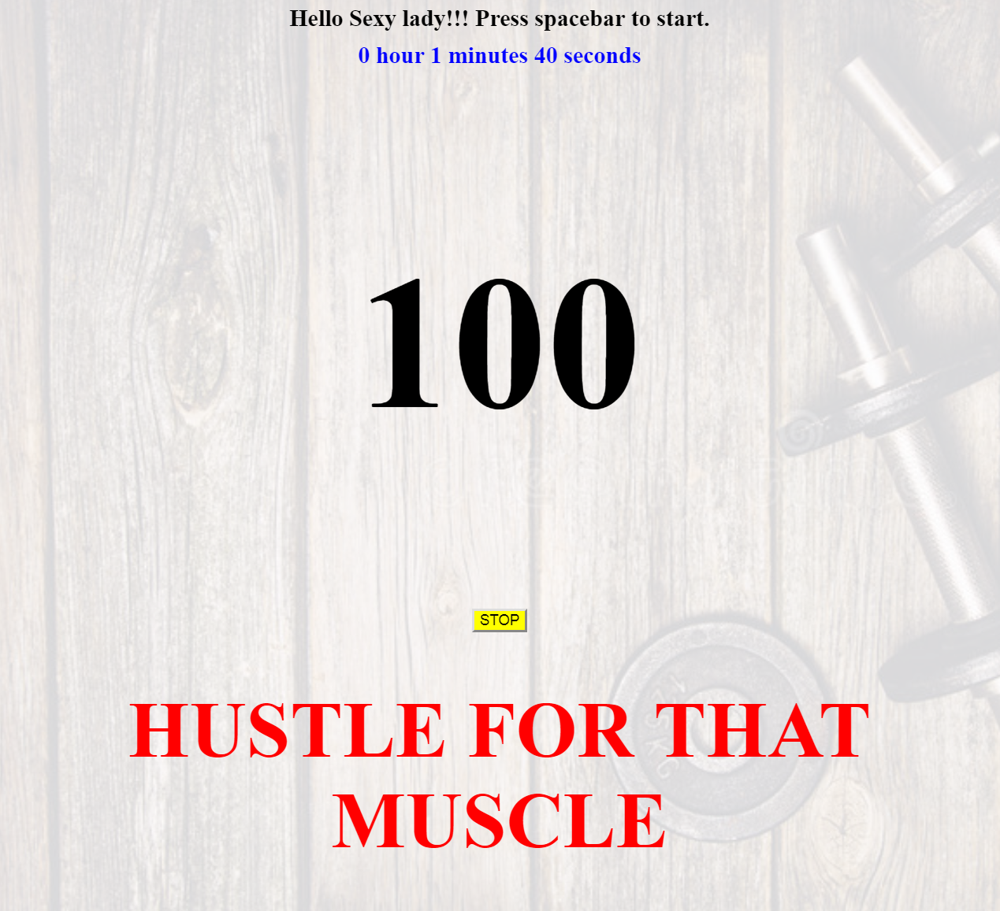

# Sophia's personal workout clock [[here](https://bunnydeviloper.github.io/workout/)]

**Stair climbing**  
1. Timer and counter start at first spacebar keydown
// TODO: start a youtube workout channel as well

2. Each time reps hit 15, the quote will randomly change to a new one
4. When user hit 100, congratulations modal will pop up showing ending time
5. Each day's result is saved to local storage, you can track your progress

### Alternative: user can press stop button to stop (eg: go running outside)

// TODO: add an input to search for songs on youtube and play it
// TODO: add commonly motivated songs list for chosing

// TODO: add an input to search travel desination
// TODO: add a map, make a route for your climb, and track it on the map

